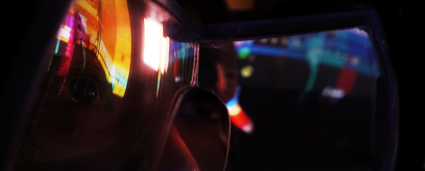

# Project North Star

Welcome to the [community built documentation](https://github.com/AlinaWithAFace/ProjectNorthStar) for \#ProjectNorthStar!

Project Northstar is an open source Augmented Reality headset originally designed by LeapMotion \(now UltraLeap\) in June, 2018. The headset is almost entirely 3D printable, with a handful of components like reflectors, circuit boards, cables, sensors and screws that need to be sourced separately. Luckily through the help of Noah Zerkin, all the parts to make North Star headsets are easily accessible through [Smart Prototyping](https://www.smart-prototyping.com/AR-VR-MR-XR/AR-VR-Kits-Bundles).

There's also a large community of Northstar developers and builders on Discord, you can join the server and share your build, ask questions, or get help with your projects by [joining the server](https://discord.gg/9TtZhb4)! The project has had many variations since its inception, by both UltraLeap and the open source community. Some of the variations are documented and linked to here, but visit the discord server for more to-the-moment information.

Hardware procurement, fabrication, and assembly instructions start in [/mechanical](mechanical/leap-motion-v3/README.md).

Software setup and calibration start in [/software](software/getting-started.md).

#General FAQ

**Have a question not mentioned here? Feel free to ask on the community [Discord](https://discord.gg/9TtZhb4)**

## What is Project North Star?

Project North Star is an open source augmented reality headset meant as a development platform for interaction prototyping it was initially released by leap motion in 2018 and continues to receive updates. 

## How can I build it?

Good Question! There are multiple variations of the reference design from leap motion. The reference design can be found here: 

[Link to the main GitHub repo](https://github.com/leapmotion/ProjectNorthStar)

## Where can I get the lenses and electronic components?

While most of the design is 3d printable, there are components, like the screens, driver board, combiners, and leap motion controller that you will have to order. You can order your parts, or fully assembled headsets here: 

[Link](https://www.smart-prototyping.com/AR-VR-MR-XR)

## What 3d printer should I get?

Most components fit within a print volume of 130mm\*130mm\*130mm, however the two largest prints will need a print volume of 220mm\*200mm\*120mm. It is possible for the parts to be split, using [MeshMaker ](https://www.youtube.com/watch?v=afLolx2OEKE&feature=youtu.be&t=93)to allow them to fit on smaller print volumes.   
  
The ender series \(220 x 220 x 250mm\) by creality seems to be a fan favorite among the discord if you're just getting started with 3d printing. If you want something that has a larger print area, check out the creality pro \(300 x 300 x 400mm\). If you want other recommendations, feel free to ask on the discord.

[Ender3d](https://www.creality3d.shop/collections/3d-printer/products/creality-ender-3-3d-printer-economic-ender-diy-kits-with-resume-printing-function-v-slot-prusa-i3-220x220x250mm)

[Creality Pro](https://www.creality3d.shop/collections/3d-printer/products/creality-cr-10s-diy-desktop-3d-printer-300x300x400mm)

## How can I track my position?

The Intel RealSense T265 is the most commonly used device currently. It supports 6dof (degrees of freedom) but does not support world meshing. 

~~The occipital structure core is great since it's cross platform and non GPU dependent and has more features, but it's more expensive than the Realsense. \(Note that if you order this you need the black and white camera version and NOT the color version\). There are members of occipital here in the discord to answer more questions, check out the \#occipital-structure-core channel.~~ **Occipital has discontinued support of the perception engine and is no longer recommended.** 

If you have a windows PC with a 1070 or above you can use the Zed Mini, but it only works with Nvidia CUDA which limits its use.

If you have a Vive already, you can use a vive tracker for 6dof tracking, however the vive tracker requires external "lighthouse" base stations in order to function, making it more difficult to transport the headset or use it in different environments without extra setup.

### What is Calibration?

Due to the nature of 3D printing and assembly each headset is going to be slightly unique and will require going through [a calibration process](../docs/calibration/calibration-v2/) to display the image correctly.   
  
There are currently two ways to calibrate a northstar headset. The first method uses two stereo cameras to calculate the 3D position of the displays and reflectors. The second method uses a single stereo camera, and is currently setup to be able to use the intel t265 camera, which we currently recommend for 6DOF. This allows northstar developers to reuse the t265 rather than purchase two seperate stereo cameras. 

